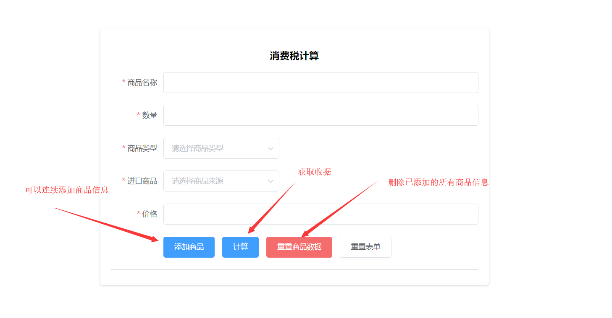
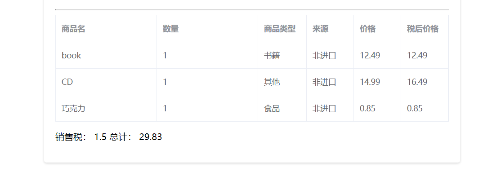
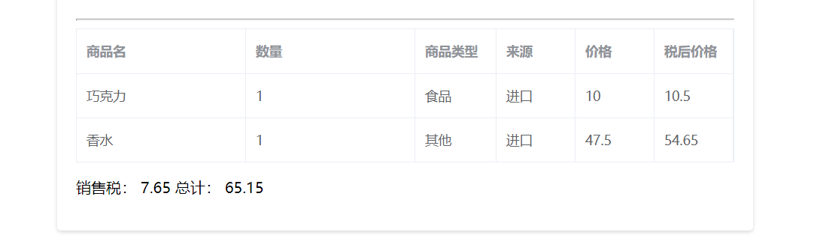
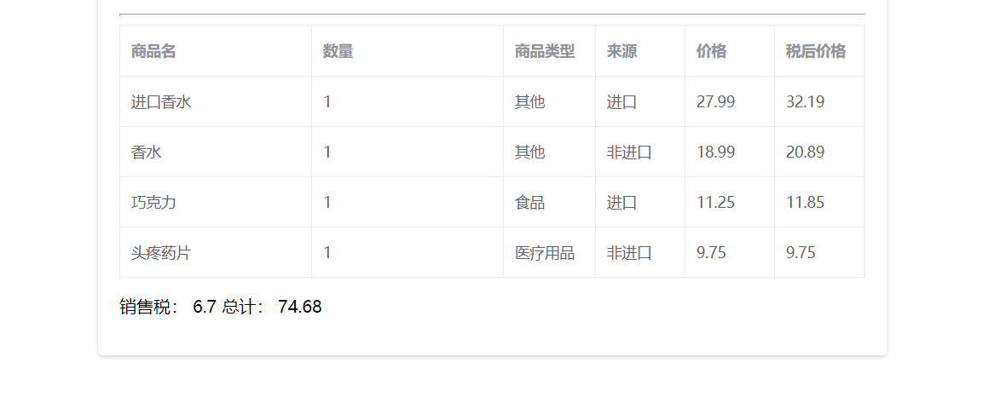

# 简介

### 项目说明

基于SpringCloud微服务框架完成一个税费计算模块，使用了如下组件：
* Eureka:注册中心
* Feign: HTTP请求调用框架
* Ribbon:客户端负载均衡工具

### 模块说明

* eureka-server: 注册中心
* goods-server: 商品服务，对商品的新增，获取等
* calculate-server: 税费计算服务
* commo-server: 工具包

### 演示
* 演示地址：http://120.79.180.167:8765/
* 注册中心地址：http://120.79.180.167:8761/

### 测试结果
* 第一组数据

* 第二组数据

* 第三组数据

